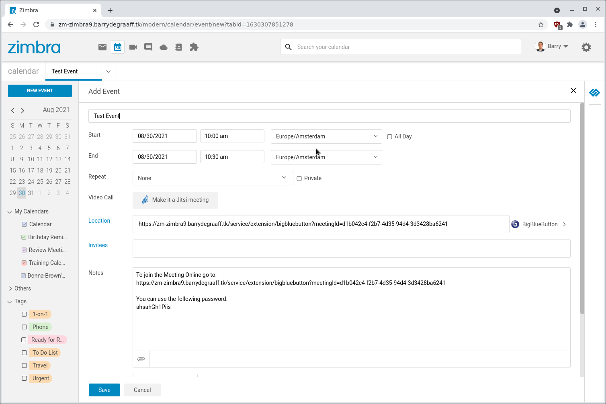
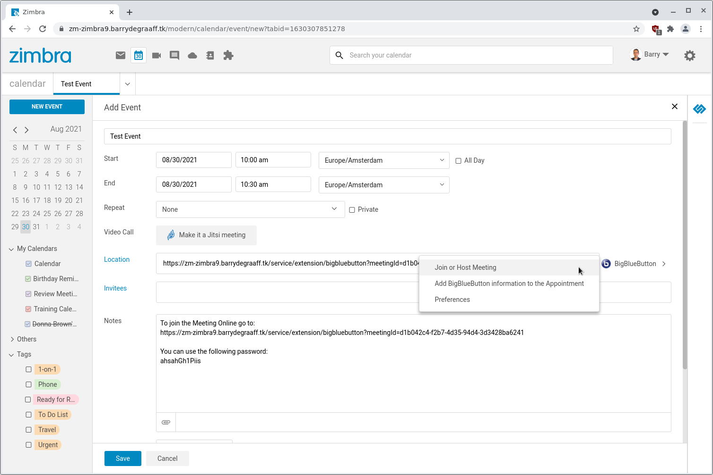
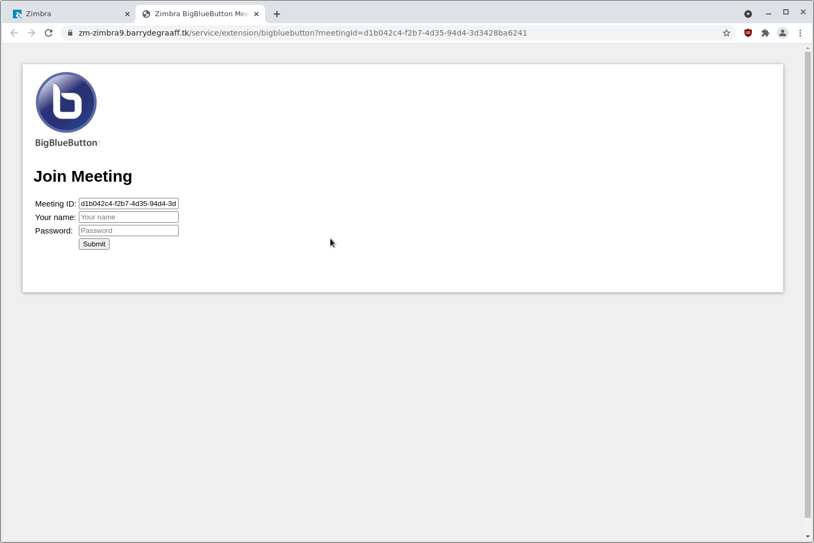
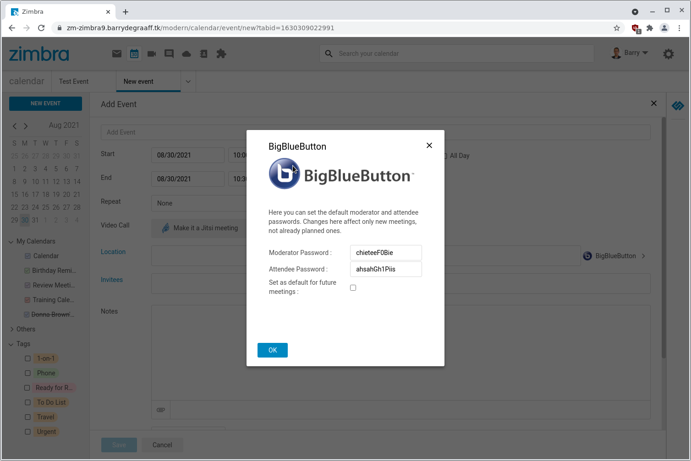

# zimbra-zimlet-bigbluebutton

Add BigBlueButton meeting information to calendar appointments in Zimbra.

## Installation

Run the installer from https://github.com/Zimbra-Community/bigbluebutton-zimlet. Then deploy the Zimlet in the releases page of this repo.

## Screenshots

> 
> 
> 
> 
